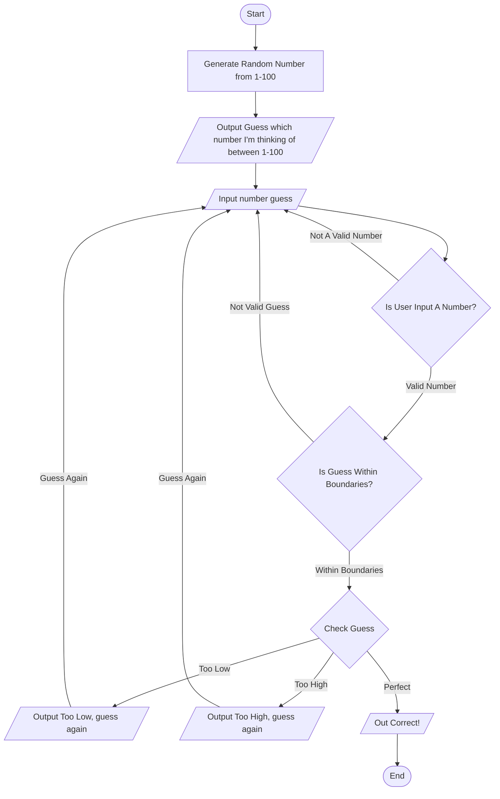

# Flowchart Summary
Starts
Generates a random number 1-100
Prompts user to pick a number from 1-100
Checks to see if input is a number, if not, reprompts
Checks to see if input is a possible number, and doesnt go out of bounds, if not, reprompts
Checks guess against generated number
If higher or lower, outputs that the number is too low / too high and prompts them to guess again
If the correct number is guess, outputs that the answer is correct
Ends
